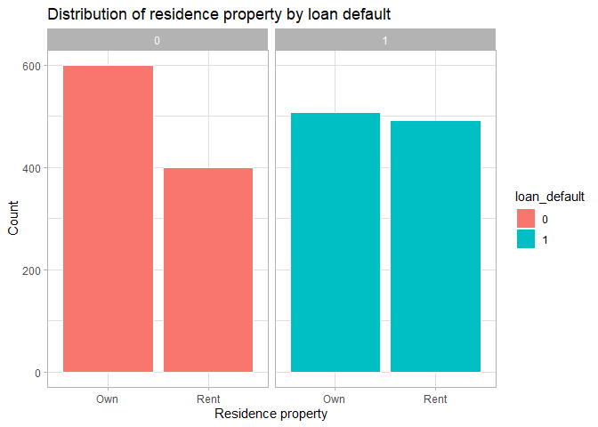

```r
#import necessary libraries
library(tidyverse)
```

```
## -- Attaching packages ----------------------------------------------------------------------------------------------------------------------------------------- tidyverse 1.3.0 --
```

```
## v ggplot2 3.2.1     v purrr   0.3.3
## v tibble  2.1.3     v dplyr   0.8.3
## v tidyr   1.0.0     v stringr 1.4.0
## v readr   1.3.1     v forcats 0.4.0
```

```
## -- Conflicts -------------------------------------------------------------------------------------------------------------------------------------------- tidyverse_conflicts() --
## x dplyr::filter() masks stats::filter()
## x dplyr::lag()    masks stats::lag()
```

```r
library(caret)
```

```
## Loading required package: lattice
```

```
## 
## Attaching package: 'caret'
```

```
## The following object is masked from 'package:purrr':
## 
##     lift
```

```r
library(psych)
```

```
## 
## Attaching package: 'psych'
```

```
## The following objects are masked from 'package:ggplot2':
## 
##     %+%, alpha
```

```r
library(mlbench)
library(e1071)
library(datasets)

#Set the working directory
setwd("/DataSets")

#load the Lending club file
load("LendingClub")

#view the data
View(LendingClub)

# Generate a sample of 1000 each
LendingClub1 = LendingClub #a copy of dataset
LendingClub = rbind(sample_n(filter(LendingClub1, loan_default==1), 1000), sample_n(filter(LendingClub1, loan_default==0), 1000))

## Descriptive statistics 

describe(LendingClub)
```

```
## Warning in describe(LendingClub): NAs introduced by coercion
```

```
## Warning in FUN(newX[, i], ...): no non-missing arguments to min; returning Inf
```

```
## Warning in FUN(newX[, i], ...): no non-missing arguments to max; returning -Inf
```

```
##                           vars    n     mean       sd   median  trimmed
## loan_default                 1 2000     0.50     0.50     0.50     0.50
## loan_amnt                    2 2000 12423.81  7240.54 10687.50 11587.00
## adjusted_annual_inc          3 2000 52868.84 42036.25 44348.00 47092.34
## pct_loan_income              4 2000     0.21     0.10     0.20     0.21
## dti                          5 2000    17.75     7.91    17.61    17.69
## residence_property*          6 2000      NaN       NA       NA      NaN
## months_since_first_credit    7 2000   181.61    85.32   165.00   172.67
## inq_last_6mths               8 2000     0.84     1.06     0.00     0.65
## open_acc                     9 2000    10.94     4.40    10.00    10.60
## bc_util                     10 2000    69.08    25.73    74.90    71.86
## num_accts_ever_120_pd       11 2000     0.28     0.82     0.00     0.08
## pub_rec_bankruptcies        12 2000     0.09     0.29     0.00     0.00
##                                mad      min       max     range  skew kurtosis
## loan_default                  0.74     0.00      1.00      1.00  0.00    -2.00
## loan_amnt                  6393.71  1000.00  35000.00  34000.00  1.09     1.06
## adjusted_annual_inc       26304.29 -8648.00 588936.00 597584.00  4.27    35.08
## pct_loan_income               0.11     0.01      0.45      0.44  0.35    -0.60
## dti                           8.93     0.00     34.92     34.92  0.06    -0.75
## residence_property*             NA      Inf      -Inf      -Inf    NA       NA
## months_since_first_credit    71.16    37.00    632.00    595.00  1.17     1.98
## inq_last_6mths                0.00     0.00      6.00      6.00  1.33     1.51
## open_acc                      4.45     1.00     34.00     33.00  0.85     1.27
## bc_util                      25.95     0.00    173.20    173.20 -0.78    -0.04
## num_accts_ever_120_pd         0.00     0.00     13.00     13.00  5.08    42.67
## pub_rec_bankruptcies          0.00     0.00      2.00      2.00  2.88     6.58
##                               se
## loan_default                0.01
## loan_amnt                 161.90
## adjusted_annual_inc       939.96
## pct_loan_income             0.00
## dti                         0.18
## residence_property*           NA
## months_since_first_credit   1.91
## inq_last_6mths              0.02
## open_acc                    0.10
## bc_util                     0.58
## num_accts_ever_120_pd       0.02
## pub_rec_bankruptcies        0.01
```


```r
# Know the data Types of the variables used in the Lending Club data
sapply(LendingClub, class)
```

```
##              loan_default                 loan_amnt       adjusted_annual_inc 
##                 "numeric"                 "integer"                 "numeric" 
##           pct_loan_income                       dti        residence_property 
##                 "numeric"                 "numeric"               "character" 
## months_since_first_credit            inq_last_6mths                  open_acc 
##                 "numeric"                 "integer"                 "integer" 
##                   bc_util     num_accts_ever_120_pd      pub_rec_bankruptcies 
##                 "numeric"                 "integer"                 "integer"
```


```r
## Data exploratory analysis

#Factor for the categorical variables
LendingClub$loan_default = factor(LendingClub$loan_default) #0 as Non-defaulted,1 as Defaulted
LendingClub$residence_property = factor(LendingClub$residence_property) #Rent or Own

# The distribution of residence property by loan default
ggplot(data = LendingClub, mapping = aes(x = residence_property)) +
  geom_bar(aes(fill = loan_default), color = "white") +
  facet_wrap(~loan_default, nrow = 1) +
  labs(title = "Distribution of residence property by loan default",
       x = "Residence property",
       y = "Count") +
  theme_light()
```

<!-- -->

Based on a sample of 1000, among people who were not defaulted, the number for those who own residence properties is greater than the number of those who rent properties.
And among those who were defaulted, the number of those who rent properties is slightly higher than those who own properties.


```r
## Logistic regression model 

# Separate the test and Training data
TrainIndex = sample(1:nrow(LendingClub), round(0.7*nrow(LendingClub)))
LendingClubTrain = LendingClub[TrainIndex, ] 
LendingClubTest = LendingClub[-TrainIndex, ]

# Predict the loan default based on Lending Club training dataset
LendingClubLogit = glm(loan_default ~ .,
                 data = LendingClubTrain,
                 family = "binomial")

#summary of the results of the model
summary(LendingClubLogit)
```

```
## 
## Call:
## glm(formula = loan_default ~ ., family = "binomial", data = LendingClubTrain)
## 
## Deviance Residuals: 
##     Min       1Q   Median       3Q      Max  
## -1.7473  -1.1363   0.7709   1.1179   1.6860  
## 
## Coefficients:
##                             Estimate Std. Error z value Pr(>|z|)    
## (Intercept)               -1.255e+00  3.247e-01  -3.866 0.000111 ***
## loan_amnt                 -2.264e-05  1.571e-05  -1.442 0.149418    
## adjusted_annual_inc        5.933e-07  2.260e-06   0.262 0.792942    
## pct_loan_income            2.962e+00  1.048e+00   2.827 0.004692 ** 
## dti                        8.121e-03  8.038e-03   1.010 0.312313    
## residence_propertyRent     3.392e-01  1.150e-01   2.950 0.003181 ** 
## months_since_first_credit -9.362e-04  6.703e-04  -1.397 0.162476    
## inq_last_6mths             2.384e-01  5.464e-02   4.364 1.28e-05 ***
## open_acc                   9.772e-03  1.396e-02   0.700 0.483962    
## bc_util                    6.628e-03  2.272e-03   2.918 0.003528 ** 
## num_accts_ever_120_pd      1.337e-01  6.595e-02   2.027 0.042620 *  
## pub_rec_bankruptcies      -1.816e-03  1.916e-01  -0.009 0.992436    
## ---
## Signif. codes:  0 '***' 0.001 '**' 0.01 '*' 0.05 '.' 0.1 ' ' 1
## 
## (Dispersion parameter for binomial family taken to be 1)
## 
##     Null deviance: 1940.1  on 1399  degrees of freedom
## Residual deviance: 1874.2  on 1388  degrees of freedom
## AIC: 1898.2
## 
## Number of Fisher Scoring iterations: 4
```

```r
# predict the loan default based on the LendingClub test data, and the confusion matrix 
LendingClubTest = LendingClubTest %>% mutate(EstimatedProb = predict(LendingClubLogit,newdata = LendingClubTest,type = "response"))
# predict Y = 1 if P(Y = 1) > 0.6
LendingClubTest = LendingClubTest %>% mutate(LendingClubLogitPred = I(EstimatedProb > 0.6) %>% as.numeric())
LendingClubTable = table(LendingClubTest$LendingClubLogitPred ,LendingClubTest$loan_default)

# confusion matrix using tables
confusionMatrix(LendingClubTable)
```

```
## Confusion Matrix and Statistics
## 
##    
##       0   1
##   0 265 205
##   1  51  79
##                                           
##                Accuracy : 0.5733          
##                  95% CI : (0.5326, 0.6133)
##     No Information Rate : 0.5267          
##     P-Value [Acc > NIR] : 0.01214         
##                                           
##                   Kappa : 0.1201          
##                                           
##  Mcnemar's Test P-Value : < 2e-16         
##                                           
##             Sensitivity : 0.8386          
##             Specificity : 0.2782          
##          Pos Pred Value : 0.5638          
##          Neg Pred Value : 0.6077          
##              Prevalence : 0.5267          
##          Detection Rate : 0.4417          
##    Detection Prevalence : 0.7833          
##       Balanced Accuracy : 0.5584          
##                                           
##        'Positive' Class : 0               
## 
```


```r
## Naïve Bayes model model

#Choose 75% of the sample size
smp_size <- floor(0.75 * nrow(LendingClub))

# set the seed to make your partition reproducible
set.seed(123)

#separate the test and training data
LendingClubtrain_ind <- sample(seq_len(nrow(LendingClub)), size = smp_size)
LendingClubtrain <- LendingClub[LendingClubtrain_ind, ]
test <- LendingClub[-LendingClubtrain_ind, ]

#Perform Naïve Bayes model using the training dataset
NVmodel <- naiveBayes(loan_default ~ .,
                      data = LendingClubtrain)

# predict the loan default based on the LendingClub test dataset, and the confusion matrix 
preds <- predict(NVmodel, newdata = test)
conf_matrix <- table(preds, test$loan_default)
NVmodel$tables
```

```
## $loan_amnt
##    loan_amnt
## Y       [,1]     [,2]
##   0 12573.09 7069.900
##   1 12467.36 7608.963
## 
## $adjusted_annual_inc
##    adjusted_annual_inc
## Y       [,1]     [,2]
##   0 56964.68 43489.63
##   1 48314.47 39058.72
## 
## $pct_loan_income
##    pct_loan_income
## Y        [,1]       [,2]
##   0 0.2013713 0.09910834
##   1 0.2216012 0.10480054
## 
## $dti
##    dti
## Y       [,1]     [,2]
##   0 17.12553 7.951311
##   1 18.80045 7.624840
## 
## $residence_property
##    residence_property
## Y         Own      Rent
##   0 0.5970549 0.4029451
##   1 0.5006640 0.4993360
## 
## $months_since_first_credit
##    months_since_first_credit
## Y       [,1]     [,2]
##   0 186.9612 86.72208
##   1 175.1819 83.53091
## 
## $inq_last_6mths
##    inq_last_6mths
## Y        [,1]      [,2]
##   0 0.7617135 0.9956911
##   1 0.9216467 1.1182583
## 
## $open_acc
##    open_acc
## Y       [,1]     [,2]
##   0 10.89960 4.278738
##   1 11.19522 4.530380
## 
## $bc_util
##    bc_util
## Y       [,1]     [,2]
##   0 66.52664 25.88843
##   1 70.50359 25.43951
## 
## $num_accts_ever_120_pd
##    num_accts_ever_120_pd
## Y        [,1]      [,2]
##   0 0.2543507 0.6962879
##   1 0.3200531 0.9715824
## 
## $pub_rec_bankruptcies
##    pub_rec_bankruptcies
## Y         [,1]      [,2]
##   0 0.09504685 0.2934761
##   1 0.09561753 0.2987464
```

